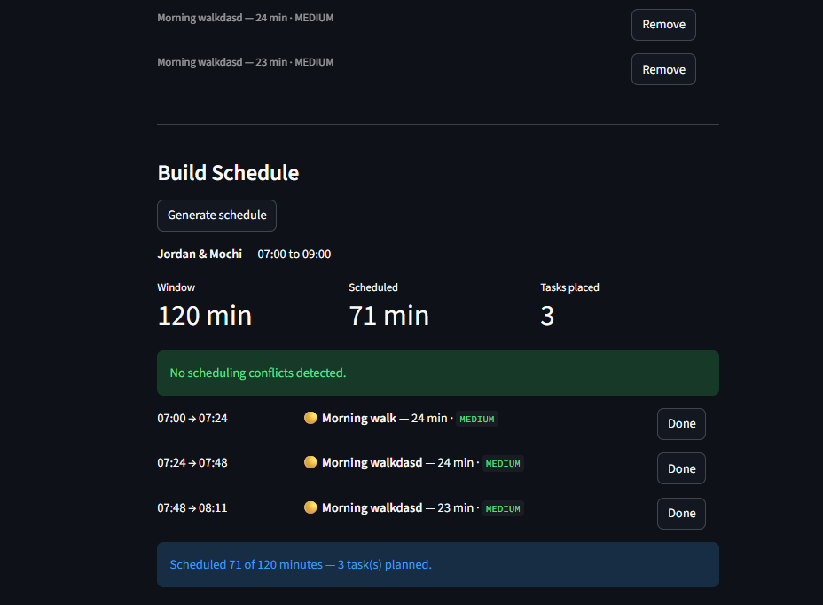

# PawPal+

A smart pet-care scheduling app built with Python and Streamlit. PawPal+ helps a busy pet owner plan their day by automatically prioritizing tasks, detecting conflicts, and remembering recurring routines.

---

## 📸 Demo




---

## Features

### Priority-based scheduling

The scheduler sorts pending tasks by **priority first** (HIGH → MEDIUM → LOW), then by **preferred time** as a tiebreaker within the same priority band. This guarantees that the most critical care tasks — medications, vet appointments — are always placed before optional enrichment activities, regardless of when they were added.

### Sort by preferred time

`Scheduler.sort_by_time()` returns a pet's task list ordered by `preferred_time` (earliest first). Tasks with no time preference are pushed to the end using a sentinel value (`24 × 60` minutes), so they never displace tasks that have an explicit ideal start time. The original task list is never mutated.

### Filter by status or pet

`Scheduler.filter_tasks(completed=..., pet_name=...)` narrows the task list without modifying the underlying data. Pass `completed=False` for the pending queue, `completed=True` for a history view, or a `pet_name` string to scope results to a specific pet. The UI exposes this as an **All / Pending / Completed** radio toggle above the task table.

### Conflict detection

Two methods guard against scheduling collisions:

- **`check_conflicts(schedule)`** — scans one pet's schedule for overlapping time slots using a pairwise interval test (`a_start < b_end and b_start < a_end`). Returns plain-English warning strings; never raises an exception so the app keeps running.
- **`cross_pet_conflicts(pairs)`** — checks whether tasks from _different_ pets overlap in time, catching cases where a single sitter cannot physically handle both pets at once.

Both methods use `itertools.combinations` to generate every unique slot pair cleanly. Results surface in the UI as `st.warning`; a conflict-free schedule shows `st.success`.

### Daily and weekly recurrence

Tasks carry a `recurrence` field (`DAILY`, `WEEKLY`, or `NONE`) and an optional `due_date`. When you click **Done** on a recurring task, `Scheduler.mark_task_complete()` marks it complete _and_ automatically appends a fresh copy to `pet.tasks` with the next due date calculated by Python's `timedelta` (+1 day for daily, +7 days for weekly). Completed tasks remain as a history record; `generate()` only schedules pending tasks.

### Greedy first-fit scheduling

`Scheduler.generate()` uses a greedy first-fit algorithm: tasks are sorted once by `(priority, preferred_time)` and placed in order — each task is scheduled if it fits in the remaining window, skipped permanently if it does not. This is O(n log n) and correct for the 5–10 tasks typical of a pet care day. Tasks that don't fit appear in a `st.table` skipped list so the owner can adjust their time window.

### Persistent data

Owner, pet, and task data are saved to `pawpal_data.json` after every change. A browser refresh reloads the last saved state automatically — nothing is lost between sessions.

---

## How to run

```bash
python -m venv .venv
source .venv/bin/activate      # Windows: .venv\Scripts\activate
pip install -r requirements.txt
streamlit run app.py
```

---

## Project structure

```
pawpal_system.py   Core domain classes and scheduling logic
app.py             Streamlit UI — connects to pawpal_system
tests/
  test_pawpal.py   11 unit tests covering sorting, recurrence, and conflict detection
UML-diagram.md     Final Mermaid.js class diagram (paste into mermaid.live)
reflection.md      Design decisions, tradeoffs, and AI collaboration notes
pawpal_data.json   Auto-generated persistence file (created on first save)
```

---

## Running the tests

```bash
python -m pytest tests/test_pawpal.py -v
```

| Area                   | What is tested                                                                                                     |
| ---------------------- | ------------------------------------------------------------------------------------------------------------------ |
| **Sorting**            | Tasks return in chronological order; `None` preferred_time always goes last; priority beats time when both are set |
| **Recurrence**         | Daily task spawns a new task due the next day; `pet.tasks` grows by 1; non-recurring tasks return `None`           |
| **Conflict detection** | Overlapping slots produce a warning; back-to-back slots do not; empty schedule returns no warnings                 |
| **Core behavior**      | Marking a task complete flips `completed`; adding tasks increases task count                                       |

All 11 tests pass. Confidence: 4/5 — core logic is solid; greedy edge cases and cross-pet integration could use more coverage.
